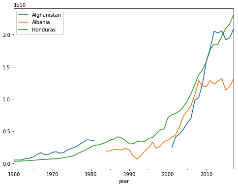

# Mini Project Data Engineer di Alterra Academy

<!-- Table of Content -->
## Table of Contents
- [Mini Project Data Engineer di Alterra Academy](#mini-project-data-engineer-di-alterra-academy)
  - [Table of Contents](#table-of-contents)
  - [1. Pengantar](#1-pengantar)
  - [2. Ekstraksi Data (Extract)](#2-ekstraksi-data-extract)
    - [2.1 File CSV](#21-file-csv)
    - [2.2 File JSON](#22-file-json)
    - [2.3 API](#23-api)
    - [2.4 File XML](#24-file-xml)
    - [2.5 Database](#25-database)
  - [3. Transformasi Data (Transformation)](#3-transformasi-data-transformation)
    - [3.1 Menggabungkan Data dari Berbagai Sumber (Combining Data from Different Sources)](#31-menggabungkan-data-dari-berbagai-sumber-combining-data-from-different-sources)
    - [3.2 Pembersihan Data (Data Cleaning)](#32-pembersihan-data-data-cleaning)
    - [3.3 Transformasi Lebih Lanjut](#33-transformasi-lebih-lanjut)
  - [4. Memuat Data (Load)](#4-memuat-data-load)
  - [5. Detail Proyek](#5-detail-proyek)
  - [6. Tools](#6-tools)
  - [7. Dataset](#7-dataset)
  - [8. Referensi](#8-referensi)


## 1. Pengantar
ETL adalah singkatan dari Extract, Transform, Load. Tujuan utama dari notebook ini adalah untuk membersihkan kumpulan data dan menggabungkannya menjadi satu tabel yang nantinya bisa digunakan untuk menjalankan model prediksi biaya total proyek Bank Dunia.

## 2. Ekstraksi Data (Extract)
### 2.1 File CSV
Data diekstrak dari file CSV yang menyimpan data terstruktur dalam format tabel sederhana.

### 2.2 File JSON
Mengambil data dari file JSON yang sering digunakan untuk pertukaran data di web.

### 2.3 API
Data juga diekstrak dari berbagai API yang menyediakan data dinamis yang diperbarui secara berkala.

### 2.4 File XML
Mengambil data dari file XML yang sering digunakan untuk pertukaran data di web.

### 2.5 Database
Mengambil data dari database SQLite yang menyimpan data dalam format tabel yang terstruktur.

## 3. Transformasi Data (Transformation)
### 3.1 Menggabungkan Data dari Berbagai Sumber (Combining Data from Different Sources)
Mengintegrasikan data yang diperoleh dari file CSV, JSON, XML, DB, dan melalui API ke dalam satu dataset yang konsisten untuk analisis lebih lanjut.

### 3.2 Pembersihan Data (Data Cleaning)
Melakukan pembersihan data yang mencakup:
- Mengatasi Data yang Hilang (Handling Missing Data)
- Menghapus Data Duplikat (Removing Duplicate Data)

### 3.3 Transformasi Lebih Lanjut
Melakukan transformasi lanjutan pada data, termasuk:
- Mengubah Tipe Data (Changing Data Types)
- Menguraikan Tanggal (Parsing Dates)
- Menangani Encoding File (Handling File Encodings)
- Menghapus Outliers (Removing Outliers)
- Penskalaan Fitur (Scaling Features)
- Membuat Variabel Dummy (Creating Dummy Variables)
- Rekayasa Fitur (Engineering Features)


## 4. Memuat Data (Load)
Mengirim data yang telah ditransformasi ke database untuk penyimpanan dan akses di masa mendatang atau menggunakan Google Cloud Storage untuk penyimpanan data yang lebih besar.

## 5. Detail Proyek

1. Extract
    - Extract data dari file projects_data.csv kemudian sesuaikan tipe data, cek missing values, duplikasi data, dan lain-lain.
    - Extract data dari population_data.csv, lakukan penyesuaian terhadap dataset ini, ada ERROR di dalam dataset ini. kemudian cek missing values, duplikasi data, dan lain-lain.
    - Extract data dari population_data.json kemudian sesuaikan tipe data, cek missing values, duplikasi data, dan lain-lain.
    - Extract data dari population_data.xml kemudian sesuaikan tipe data, cek missing values, duplikasi data, dan lain-lain. teknisnya menggunakan library bs4 (BeautifulSoup) untuk melakukan parsing data XML.
        ```xml
        <record>
            <field name="Country or Area" key="ABW">Aruba</field>
            <field name="Item" key="SP.POP.TOTL">Population, total</field>
            <field name="Year">1960</field>
            <field name="Value">54211</field>
        </record>
        ```
    - Extract data dari population_data.db gunakan library sqlite3 atau sqlalchemy untuk melakukan query data dari database SQLite. untuk query antara lain adalah
        ```sql
        1. SELECT * FROM population_data
        2. SELECT "Country_Name", "Country_Code", "1960" FROM population_data
        ```
    - Extract data dari API menggunakan library requests untuk mengambil data dari API World Bank. API World Bank memiliki endpoint yang dapat digunakan untuk mengambil data populasi dari berbagai negara.
        ```plaintext
        API: http://api.worldbank.org/v2/countries/ + list of country abbreviations separated by ; + /indicators/ + indicator name + ? + options
        Example: http://api.worldbank.org/v2/countries/br;cn;us;id/indicators/SP.POP.TOTL/?format=json&per_page=1000
        ```

2. Transform
    - Kombinasikan data dari rural_population_percent.csv dan electricity_access_percent.csv yang merupakan data populasi pedesaan dan akses listrik dari berbagai negara. dan kemudian gabungkan menggunakan pandas. (jangan lupa melakukan penyesuaian terhadap dataset ini, cek missing values, duplikasi data, dan lain-lain).
    - Cleaning Data population_data.csv, population_data.json, population_data.xml, dan population_data.db. lakukan penyesuaian terhadap dataset ini, cek missing values, duplikasi data, dan lain-lain.
    - Penyesuaian tipe data untuk dataset projects_data.csv, population_data.csv, population_data.json, population_data.xml, dan population_data.db. misalnya yang sesuai dengan tipe data datetime, float, integer, string, dan lain-lain. bisa menggunakn to_numeric, to_datetime, dan lain-lain.
    - Encoding dataset mystery.csv yang memiliki encoding berbeda. gunakan encoding='utf-16' untuk membaca dataset ini.
    - Imputing Data pada dataset gdp_data.csv yang memiliki missing values. gunakan SimpleImputer untuk mengisi missing values pada dataset ini atau teknik lain seperti menggunakan fillna, mean, median, dan lain-lain.
     
     Gambar diatas untuk afganistan dan albania tidak memiliki data, ada gap dalam plot diatas
    - Menghapus duplikasi data pada dataset projects_data.csv, population_data.csv, population_data.json, population_data.xml, dan population_data.db. gunakan fungsi drop_duplicates() untuk menghapus duplikasi data.
    - Dummy Variables untuk dataset projects_data.csv, population_data.csv, population_data.json, population_data.xml, dan population_data.db. gunakan fungsi get_dummies() untuk membuat dummy variables pada dataset ini. tapi ingat tidak perlu untuk membuat dummy variables pada semua kolom, cukup pada kolom yang memiliki data kategorikal saja.
    - Replace dan Regex pada dataset projects_data.csv, population_data.csv, population_data.json, population_data.xml, dan population_data.db. gunakan fungsi replace() dan regex() untuk melakukan penggantian nilai pada dataset ini. misalnya '(Trial) Banking' menjadi 'Banking'
    - Menghapus Outliers pada dataset projects_data.csv, population_data.csv, population_data.json, population_data.xml, dan population_data.db. gunakan teknik IQR, Z-Score, atau teknik lain untuk menghapus outliers pada dataset ini. kemudian buatkan presentasi visualisasi data sebelum dan sesudah menghapus outliers. (boxplot, histogram, atau teknik lain).
    - Scaling Features pada dataset projects_data.csv, population_data.csv, population_data.json, population_data.xml, dan population_data.db. gunakan StandardScaler, MinMaxScaler, atau teknik lain untuk melakukan scaling pada dataset ini. contohnya pada fitur GDP atau population.
    - Feature Engineering pada dataset projects_data.csv, population_data.csv, population_data.json, population_data.xml, dan population_data.db. lakukan feature engineering pada dataset ini, misalnya menambahkan kolom baru, menggabungkan kolom, atau teknik lain untuk meningkatkan kualiats data. misalnya gdppercapita = gdp/population.

3. Load
   - Kolom countryname, countrycode, year, gdp, population, gdppercapita, ruralpopulationpercent, electricityaccesspercent, dan projectcost adalah kolom yang akan di load ke dalam database, file dam cloud storage.

4. Data Visualization
    - Visualisasikan data pada dataset projects_data.csv, population_data.csv, population_data.json, population_data.xml, dan population_data.db. gunakan teknik visualisasi seperti plotly, matplotlib, seaborn, atau teknik visualisasi lain untuk membuat visualisasi data yang informatif dan menarik. misalnya plotly express, plotly graph_objects, atau teknik visualisasi lain.
    - Buatlah analisis data yang informatif dan menarik dari dataset projects_data.csv, population_data.csv, population_data.json, population_data.xml, dan population_data.db. analisis ini bisa berupa analisis statistik deskriptif, analisis korelasi, analisis distribusi, analisis tren, analisis perbandingan, atau analisis lain yang informatif. gunakan teknik visualisasi untuk membuat analisis ini lebih menarik dan informatif.
    - Buatlah presentasi visualisasi data yang informatif dan menarik dari dataset projects_data.csv, population_data.csv, population_data.json, population_data.xml, dan population_data.db. presentasi ini bisa berupa dashboard, slide presentasi, atau teknik presentasi lain yang informatif. gunakan teknik visualisasi untuk membuat presentasi ini lebih menarik dan informatif.
    - Buatlah analisis data yang informatif dan menarik dari dataset projects_data.csv, population_data.csv, population_data.json, population_data.xml, dan population_data.db. analisis ini bisa berupa analisis statistik deskriptif, analisis korelasi, analisis distribusi, analisis tren, analisis perbandingan, atau analisis lain yang informatif. gunakan teknik visualisasi untuk membuat analisis ini lebih menarik dan informatif.
    - Buatlah presentasi visualisasi data yang informatif dan menarik dari dataset projects_data.csv, population_data.csv, population_data.json, population_data.xml, dan population_data.db. presentasi ini bisa berupa dashboard, slide presentasi, atau teknik presentasi lain yang informatif. gunakan teknik visualisasi untuk membuat presentasi ini lebih menarik dan informatif.
    - Buatlah analisis data yang informatif dan menarik dari dataset projects_data.csv, population_data.csv, population_data.json, population_data.xml, dan population_data.db. 
    - dari Kolom countryname, countrycode, year, gdp, population, gdppercapita, ruralpopulationpercent, electricityaccesspercent, dan projectcost buatkan visualisasi data yang informatif dan menarik. analisis ini bisa berupa analisis statistik deskriptif, analisis korelasi, analisis distribusi, analisis tren, analisis perbandingan, atau analisis lain yang informatif. gunakan teknik visualisasi untuk membuat analisis ini lebih menarik dan informatif.

## 6. Tools
- Python
- Library in Python: Pandas, Numpy, Matplotlib, Seaborn, Plotly, etc.
- Jupyter Notebook
- Google Cloud Storage
- SQLite
- API World Bank
- XML
- JSON
- CSV
- DB
- Apache Airflow
- Dataflow
- other, etc.

## 7. Dataset
Berikut adalah beberapa dataset yang digunakan dalam proyek ini:
- **electricity_access_percent.csv**: Data tentang persentase akses listrik di berbagai negara.
- **gdp_data.csv**: Data tentang Produk Domestik Bruto (GDP) negara-negara.
- **mystery.csv**: Sebuah dataset dengan konten yang belum ditentukan, memerlukan investigasi lebih lanjut.
- **population_data.csv**: Data populasi negara-negara dalam format CSV.
- **population_data.db**: Database SQLite yang berisi data populasi negara-negara.
- **population_data.json**: Data populasi negara-negara dalam format JSON.
- **population_data.xml**: Data populasi negara-negara dalam format XML, yang diurai menggunakan library seperti BeautifulSoup.
- **projects_data.csv**: Data tentang proyek-proyek yang telah atau sedang dilaksanakan oleh Bank Dunia.
- **rural_population_percent.csv**: Data tentang persentase populasi pedesaan di berbagai negara.
- **API World Bank**: API yang menyediakan data populasi negara-negara.

## 8. Referensi
- [Pandas Documentation](https://pandas.pydata.org/docs/)
- [Numpy Documentation](https://numpy.org/doc/)
- [Matplotlib Documentation](https://matplotlib.org/stable/contents.html)
- [Seaborn Documentation](https://seaborn.pydata.org/)
- [Plotly Documentation](https://plotly.com/python/)